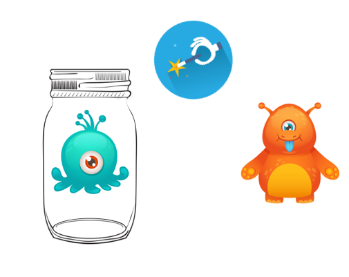
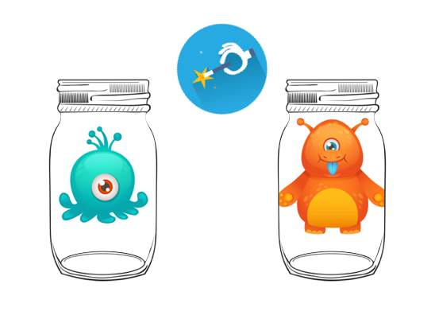
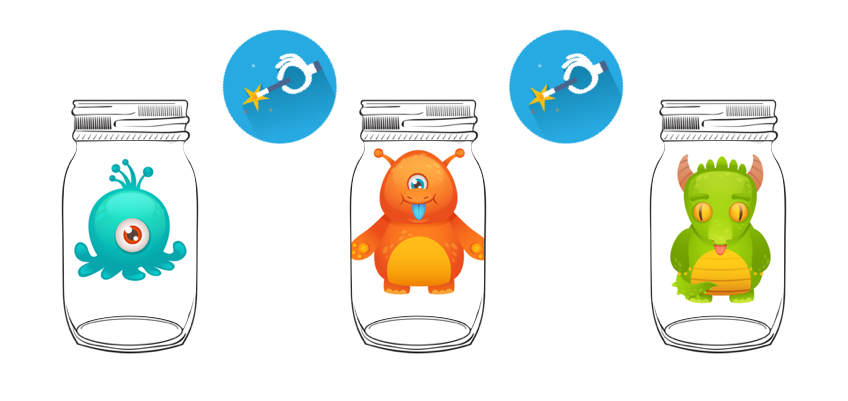

# Functor et Monad

J'ai souvent essayé de me mettre à Scala, mais j'ai souvent entendu des "gros mots" de la part des personnes à qui je demandais des conseils ou des explications, et cela donnait en général ceci:


*Au passage, un GRAND MERCI aux [@CommitStrip](https://twitter.com/commitstrip)*

... Mais c'est vexant de rien comprendre, du coup j'ai pris mon courage à 🙌 et j'ai recommencé, plutôt en regardant les autres langages, la théorie, etc... et tou ça avec du JavaScript. Oui, je sais, ce n'est pas typé, peut-être pas adapté, mais "je lis le JavaScript" 😜

## Précautions d'usage

> WIP

## Essai de définition

> WIP

Commençons par la notion de **Container**.

## Container

Alors un container, voyez ça comme un bocal dans lequel vous voulez conserver quelque chose pour le garder intact (conservation des griottes dans l’alcool par exemple), bien fermé pour que les enfants ne puissent pas y toucher. Donc en gros un contenant qui fait que le contenu n’a pas d’impact sur le monde extérieur et vice et versa 


Et en JavaScript, cela donnerait ceci:

```javascript
class Container {
  constructor(x) {
    const value = x;
    Object.defineProperty(this, "value", { get: () => value })
  }

  static of(x) {
    return new Container(x);
  }
}
```

Et pour l'utiliser:
```javascript
let bob = Container.of("Bob Morane");
bob.value == "Bob Morane" // true
bob.value = "John Doe" // ne fonctionnera pas
```

On a donc la garantie que la valeur de départ ne "bougera pas". Mais tout ça n'est pas très utile finalement. Allons donc voir ce qu'est un **Functor**.

## Functor



Je voudrais pouvoir faire des opérations sur mes containers, pour pouvoir produire de nouvelles valeurs, en laissant la précédente dans son bocal



Mais comme je veux garder le principe d’immutabilité que j’avais avec mon container, en fait je veux produire de nouveaux containers (== mettre la nouvelle valeur dans un nouveau container), qui eux-même vont pouvoir produire de nouvelles valeurs dans des containers.



Pour cela, il nous faut un **Functor**, ... Et c'est tout simplement un **Container** avec une méthode `map`!

```javascript
class Functor {  // je vous 👂 déjà, j'aurais pu faire un extends Container, mais je ne suis pas obligé 😜
  constructor(x) {
    const value = x;
    Object.defineProperty(this, "value", { get: () => value }) // sortie
  }

  static of(x) {
    return new Functor(x);
  }

  map (fn) {
    return Functor.of(fn(this.value));
  }
}
```

Cette  méthode `map` va servir à "chainer des opérations" sur un **Container**... Je vous montre:

```javascript
let panda = Functor.of('🐼')

let addLapinouBuddy = (me) => me + '🐰'
let addCatBuddy = (me) => me + '🐱'

panda.map(addLapinouBuddy).value == '🐼🐰'== true

panda
  .map(addLapinouBuddy)
  .map(addCatBuddy)
  .value ==  '🐼🐰🐱'== true
```

Ce n'est pas clair? 🙀


