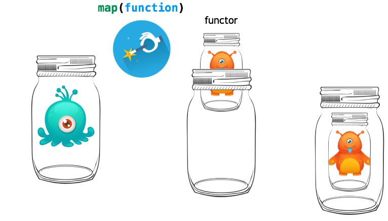
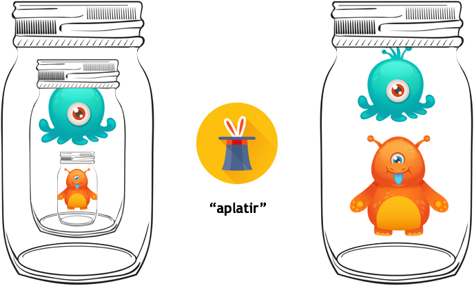
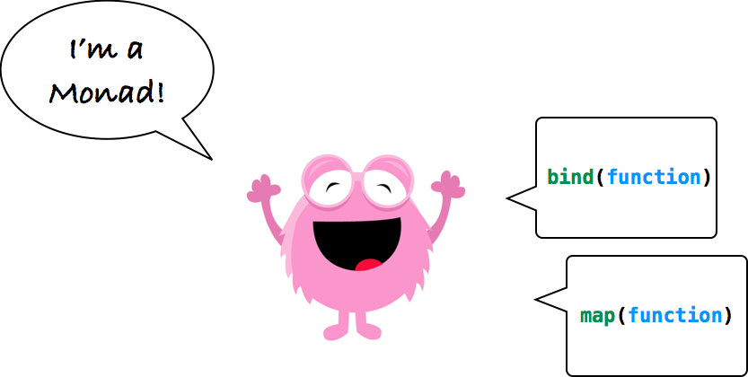

# Functor et Monad

J'ai souvent essayé de me mettre à Scala, mais j'ai souvent entendu des "gros mots" de la part des personnes à qui je demandais des conseils ou des explications, et cela donnait en général ceci:


*Au passage, un GRAND MERCI aux [@CommitStrip](https://twitter.com/commitstrip)*

... Mais c'est vexant de rien comprendre, du coup j'ai pris mon courage à 🙌 et j'ai recommencé, plutôt en regardant les autres langages, la théorie, etc... et tou ça avec du JavaScript. Oui, je sais, ce n'est pas typé, peut-être pas adapté, mais "je lis le JavaScript" 😜

## Précautions d'usage

> WIP

## Essai de définition

> WIP

Commençons par la notion de **Container**.

## Container

Alors un container, voyez ça comme un bocal dans lequel vous voulez conserver quelque chose pour le garder intact (conservation des griottes dans l’alcool par exemple), bien fermé pour que les enfants ne puissent pas y toucher. Donc en gros un contenant qui fait que le contenu n’a pas d’impact sur le monde extérieur et vice et versa 


Et en JavaScript, cela donnerait ceci:

```javascript
class Container {
  constructor(x) {
    const value = x;
    Object.defineProperty(this, "value", { get: () => value })
  }

  static of(x) {
    return new Container(x);
  }
}
```

Et pour l'utiliser:
```javascript
let bob = Container.of("Bob Morane");
bob.value == "Bob Morane" // true
bob.value = "John Doe" // ne fonctionnera pas
```

On a donc la garantie que la valeur de départ ne "bougera pas". Mais tout ça n'est pas très utile finalement. Allons donc voir ce qu'est un **Functor**.

## Functor


Je voudrais pouvoir faire des opérations sur mes containers, pour pouvoir produire de nouvelles valeurs, en laissant la précédente dans son bocal


Mais comme je veux garder le principe d’immutabilité que j’avais avec mon container, en fait je veux produire de nouveaux containers (== mettre la nouvelle valeur dans un nouveau container), qui eux-même vont pouvoir produire de nouvelles valeurs dans des containers.


Pour cela, il nous faut un **Functor**, ... Et c'est tout simplement un **Container** avec une méthode `map`!

```javascript
class Functor {  // je vous 👂 déjà, j'aurais pu faire un extends Container, mais je ne suis pas obligé 😜
  constructor(x) {
    const value = x;
    Object.defineProperty(this, "value", { get: () => value }) 
  }

  static of(x) {
    return new Functor(x);
  }

  map (fn) {
    return Functor.of(fn(this.value));
  }
}
```

Cette  méthode `map` va servir à "chainer des opérations" sur un **Container**... 
Cette  méthode `map`:
- prend une fonction / closure comme paramètre
- applique cette fonction à la valeur du Container (en fait du Functor)
- "retourne" un nouveau Container/Functor contenant la nouvelle valeur (résultat de la fonction)
- l'ancien Container/Functor "n'a pas bougé"

Je vous montre:

```javascript
let panda = Functor.of('🐼')

let addLapinouBuddy = (me) => me + '🐰'
let addCatBuddy = (me) => me + '🐱'

panda.map(addLapinouBuddy).value == '🐼🐰' // true

panda
  .map(addLapinouBuddy)
  .map(addCatBuddy)
  .value ==  '🐼🐰🐱' //true
```

Comment ça ce n'est pas clair? 🙀 ... Je recommence:

```javascript
let addOne = (value) => value + 1;
let multiplyBy5 = (value) => value * 5;
let divideByThree = (value) => value / 3;

let a = Functor.of(23.2);

let b = a
  .map(addOne)
  .map(addOne)
  .map(multiplyBy5)
  .map(divideByThree);

b.value == 42;
```

Donc c’est super intéressant pour appliquer un ensemble de traitements tout en gardant l’état initial (et éventuellement les états intermédiaires).

Donc, le **Functor**, c'est pas dur, c'est un container avec une méthode `map`


Donc c'est plutôt :tada: non? Maintenant, vous êtes prêts à passer au mot qui fait 😱: la **Monad** *(avec un `e` ou pas ❓)*

## Monad

Nous avons vu que le Functor nous permettait d’obtenir d’autres Functors à partir d’une opération (via `map`) qui prend la valeur du Functor, la transforme pour retourner une nouvelle valeur, et la colle dans un nouveau Functor. Mais imaginons que notre opération que l’on passe à `map`, elle retourne un Functor.



Là c'est le drame! Por récupérer les données, il va falloir faire `myFunctor.value.value` (donc si on map des fonctions qui retournent des Functors ça commence à nous retourner des Functors de Functors de Functors... 😝). Du coup faut "aplatir": c’est à dire que je veux une méthode qui supprime les bocaux imbriqués. Nous allons donc ajouter à notre Functor, une méthode `bind`:



Donc, c'est pas dur, une **Monad** c'est un **Functor** avec une méthode `bind`! 🤗

```javascript
class Monad {
  constructor(x) {
    const value = x;
    Object.defineProperty(this, "value", { get: () => value }) 
  }

  static of(x) {
    return new Monad(x);
  }

  map (fn) {
    return Monad.of(fn(this.value));
  }
  /* So, I'm a monad */
  bind (fn) {
    return fn(this.value);
  }
}
```

Et nous l'utiliserons comme ceci:
```javascript
let panda = Monad.of('🐼')
let addTigrouBuddy = (me) => Monad.of(me + '🐯')

let fullOfBuddies = panda
  .bind(addTigrouBuddy)
  .bind(addTigrouBuddy)
  .bind(addTigrouBuddy)
  .bind(addTigrouBuddy)

fullOfBuddies.value == '🐼🐯🐯🐯🐯' //true
```

Donc, une **Monad**, c'est ça:



Comme quoi ...

Je voudrais vous parler aussi de Maybe, Either, Validation, ... mais cela sera pour plus tard. Si vous ne pouvez pas attendre (bande d'impatients!), vous pouvez regardez cette vidéo où je tente d'expliquer tout cela: https://youtu.be/ZAtdKvpc1UQ

@+ :heart:
