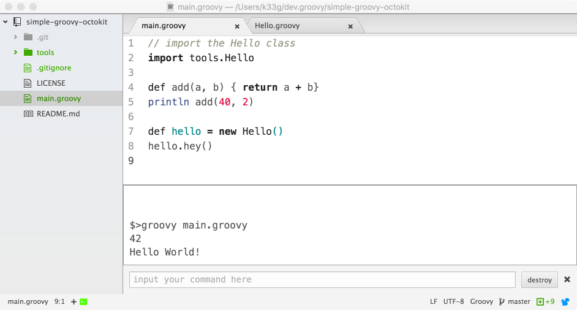

# Commencer à jouer avec Groovy "tout de suite" avec Atom

Groovy est beaucoup plus intuitif à utiliser que Java. Je l'utilise régulièrement, et ce que j'aime bien, c'est de pouvoir coder en Groovy avec simplement un éditeur de texte (Atom) pour commencer rapidement à mettre en oeuvre une idée. Donc dans ce document, je vous donne 2,3 petits trucs pour commencer paisiblement.

Pour l'installation de Groovy, je vous laisse vous débrouiller

## Mes choix d'outils

- IDE: Atom Editor https://atom.io/
- plugins pour Atom:
  - support de Groovy: https://atom.io/packages/language-groovy
  - Terminal-Panel (pour lancer des commandes directement dans Atom): https://atom.io/packages/terminal-panel

## Mon 1er programme Groovy

```groovy
// mon 1er programme Groovy

def add(a, b) {
  return a + b
}

println add(40, 2)
```

Et pour l'exécuter sans sortir d'Atom:
- lancer **Terminal-Panel** avec `Ctrl+Shift+T` ou `Pomme+Shift+T` si vous êtes sous OSX
- taper `groovy main.groovy` dans la zone de saisie


## Faire des packages

Forcément, vous allez vouloir aller plus loin et vous faire des outils. Par exemple, vous voulez:
- une classe `Hello` avec une méthode `hey`
- cette classe appartient à un package `tools`

Pour cela, c'est tout simple, la procédure à suivre pour que **Groovy** s'y retrouve "tout seul" est la suivante:
- créez un répertoire `tools`
- dans ce répertoire créer un fichier `Hello.groovy`
```groovy
package tools

class Hello {
  def hey() {
    println "Hello World!"
  }
}
```
- et pour l'utiliser dans votre fichier `main.groovy`, c'est simple
```groovy
// import the Hello class
import tools.Hello

def add(a, b) { return a + b}
println add(40, 2)

def hello = new Hello()
hello.hey()
```
- puis lancer **Terminal-Panel** 
- et taper `groovy main.groovy` dans la zone de saisie


