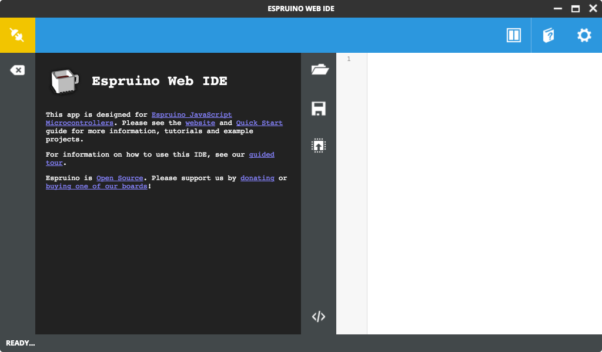
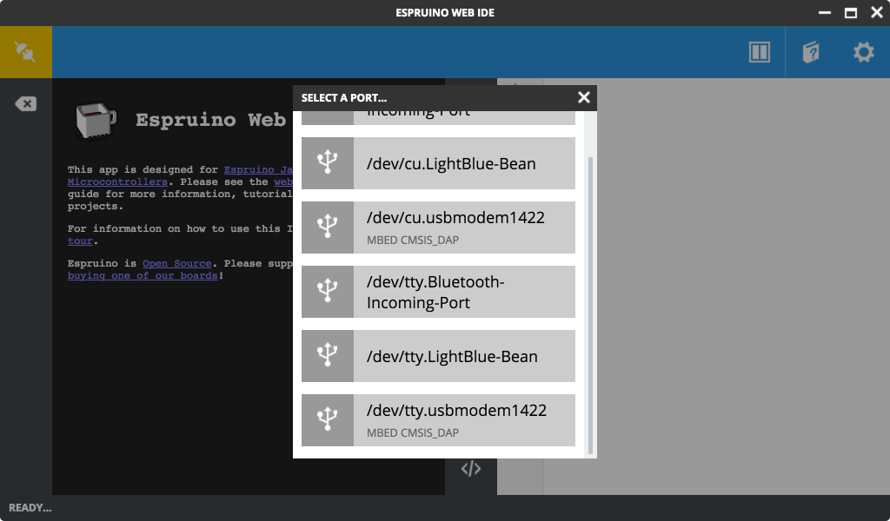
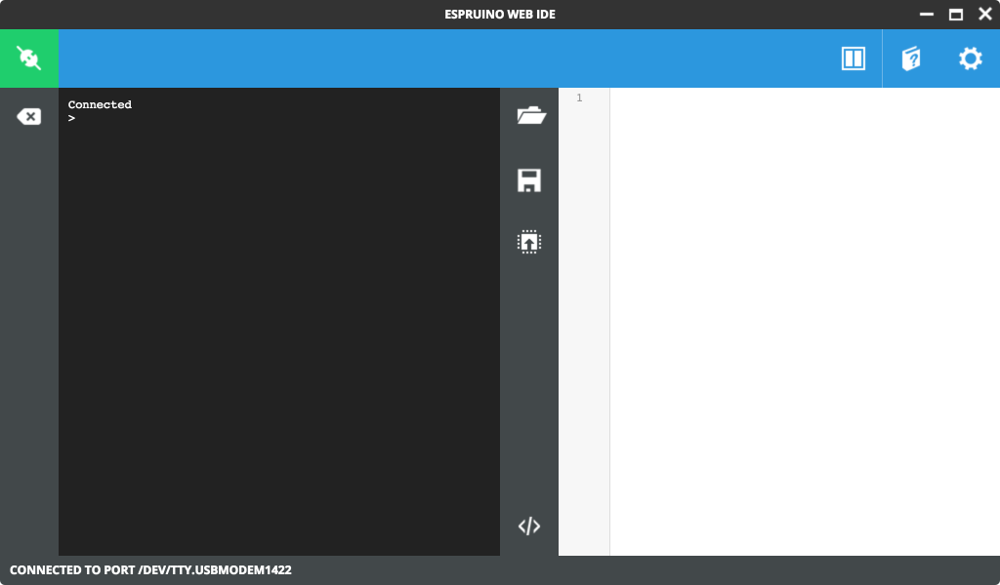
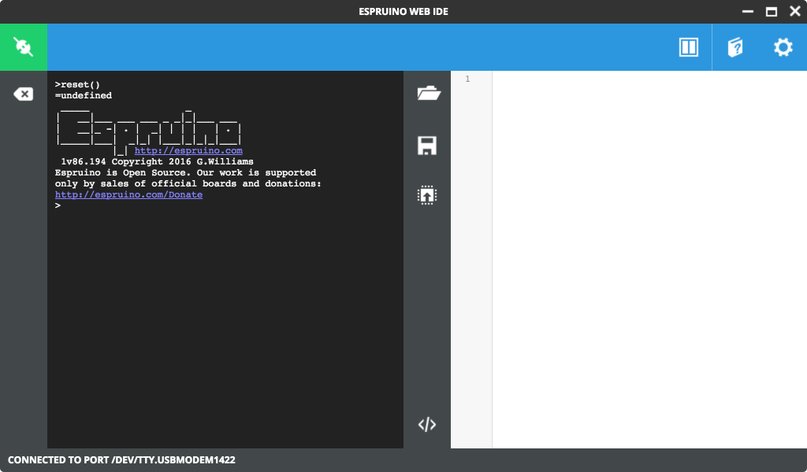
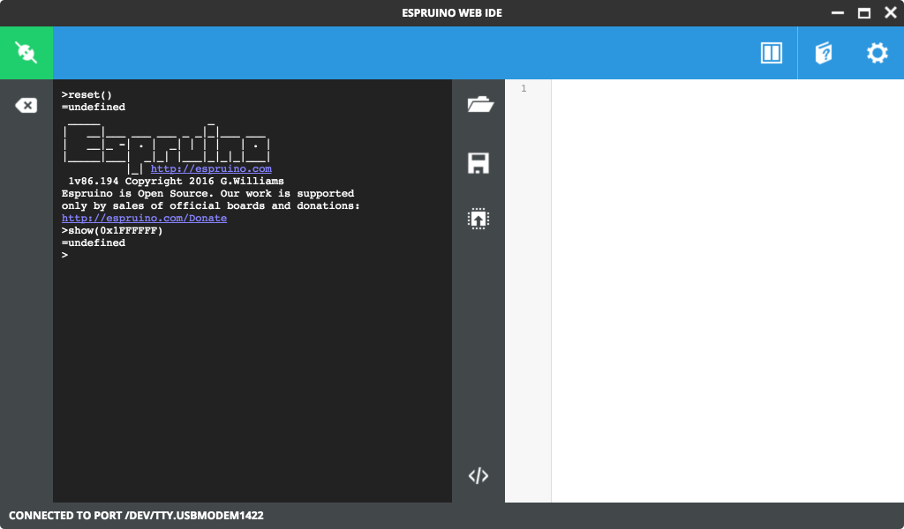
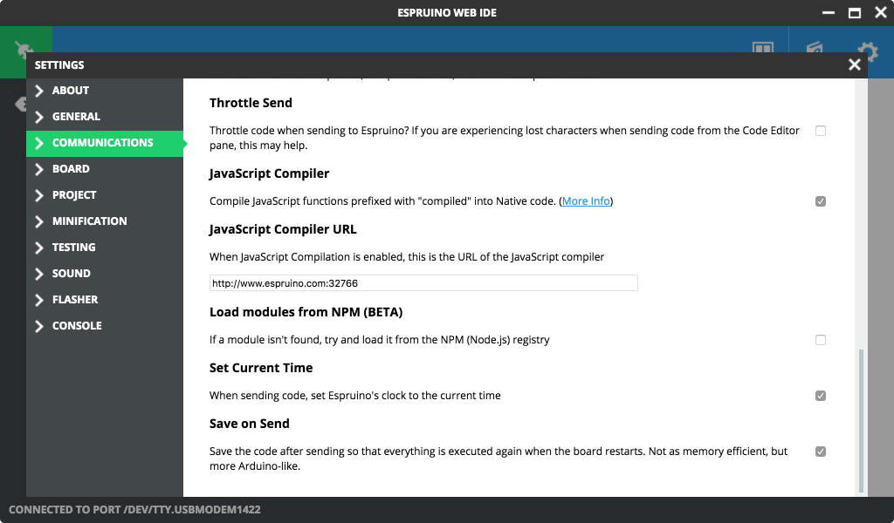
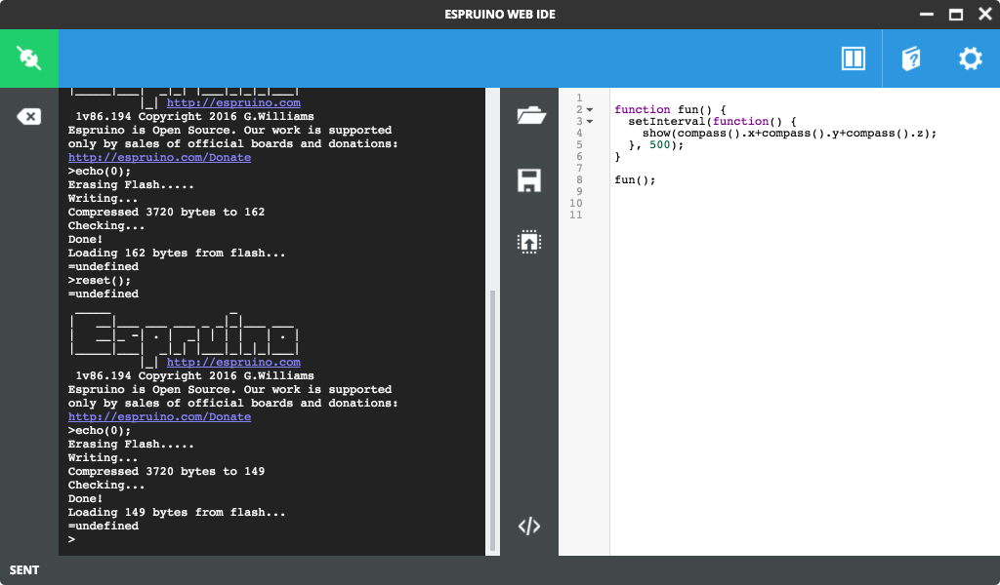
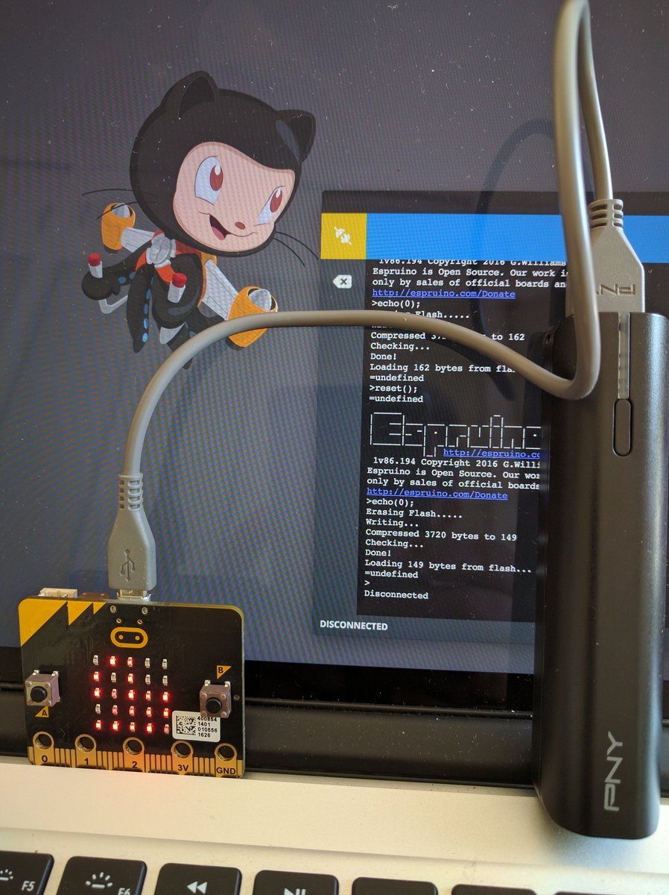

# Micro:bit - 1ère fois ... Avec Espruino

## Intro - ???

J'ai beaucoup de chance, [@titimoby](https://twitter.com/titimoby) m'a passé hier un **micro:bit**. Le **micro:bit** est un micro-contrôleur distribué (gratuitement aux enfants) pour les initier à la programmation et à l'électronique (hep la :fr: vous faites quoi vous?!). Le **micro:bit** possède des leds, un accéléromètre, un magnétomètre et une antenne bluetooth. Vous trouverez des informations par ici: https://www.microbit.co.uk/

## Coder ???

Il y a différentes façons de coder un micro:bit (see [https://www.microbit.co.uk/create-code](https://www.microbit.co.uk/create-code)). Ce matin, en cherchant un peu sur Internet, j'ai vu que l'on pouvait utiliser le firmware **Espruino** sur un **micro:bit**, je voulais depuis longtemps tester Espruino, c'est donc l'occasion :wink:. Espruino, c'est un micro-contrôleur qui se code en JavaScript (http://www.espruino.com/) et il se trouve que d'autres micro-contrôleurs sont compatibles avec **Espruino**, dont le **micro:bit**.

C'est parti :rocket: :bangbang:

### Installation

- Flashez votre **micro:bit**:
  - downloadez le build Espruino spéficique au **micro:bit** (par ici http://www.espruino.com/binaries/travis/master/ au moment où j'écris, j'utilise la version `espruino_1v86.194_microbit.hex`)
  - plugguez/connectez votre **micro:bit** sur votre :computer: (USB)
  - copiez `espruino_1v86.194_microbit.hex` à la racine
  - ne soyez pas surpris, cela va déconnecter votre **micro:bit** 
- Installez l'IDE
  - pour le moment, nous allons utiliser l'IDE version "Chrome App":
    - https://chrome.google.com/webstore/detail/espruino-web-ide/bleoifhkdalbjfbobjackfdifdneehpo
    - je chercherais plus tard si l'on peut trouver autre chose

### Connexion

- Tout d'abord re connectez le **micro:bit** et lancer la Chrome App



- Connectez vous en cliquant sur la "prise" dans le coin en haut à gauche
- Sélectionnez votre **micro:bit** (générallement cela ressemble à `/dev/tty.usbmodem...`)



- Si tout va bien, vous obtenez ceci:



- Vous pouvez taper `reset()` et valider dans la console (cela re-initialise Espruino)



- Vous pouvez tester d'autres commandes, par exemple `show(0x1FFFFFF)` allumera toutes les leds de votre **micro:bit**



- Maintenant, aller cocher la case "Save on Send" dans `settings/communications`, ainsi lorsque vous "enverrez" du code sur votre **micro:bit**, il sera sauvegardé dessus et s'exécutera à nouveau lorsque vous reconnecterez votre **micro:bit** sur une source d'énergie, sans forcément avoir besoin de l'IDE (le **micro:bit** fonctionnera de manière indépendante):



- Ensuite, dans la partie droite de l'IDE saisissez ce code:

```javascript
function fun() {
  setInterval(function() {
    show(compass().x+compass().y+compass().z);
  }, 500);
}

fun();
```

L'objet `compass()` du **micro:bit** c'est une sorte de boussole (https://www.microbit.co.uk/functions/compass-heading) et dans mon exemple, je passe la somme de ses 3 composantes `x, y, z` à la méthode `show`, qui du coup affichera toutes les 500ms un pattern avec les leds:



- Ensuite cliquez sur l'icone avec une :arrow_up: sur un micro processeur (dans la barre d'outil vertical et central)
- Cela va envoyer le code sur le **micro:bit** et l'exécuter
- Déconnectez votre **micro:bit**
- Connectez le par exemple sur une batterie externe de téléphone ...
- ... et le programme démarre tout seul de façon autonome



Et hop, c'est terminé pour cette fois ci.

## Pistes pour le prochain article

- Johnny 5
- Node et BLE
- Beacon
- ...

## Resources

### JavaScript :wink:

- micro:bit et nodejs: https://github.com/sandeepmistry/node-bbc-microbit
- micro:bit et Johnny 5: https://github.com/sandeepmistry/node-bbc-microbit-io
- Espruino on micro:bit: http://www.espruino.com/MicroBit

