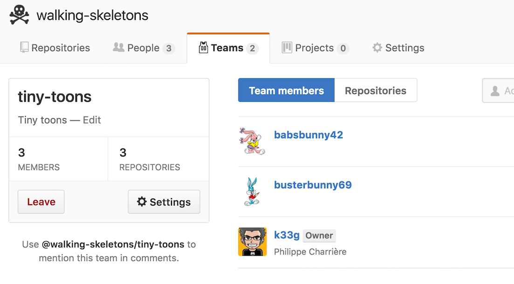
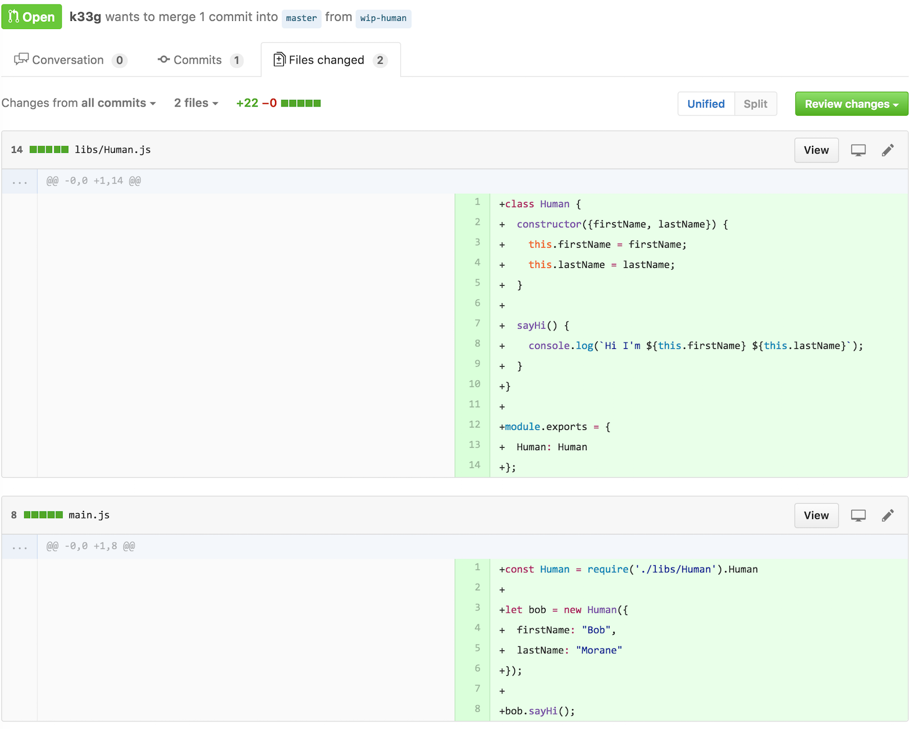
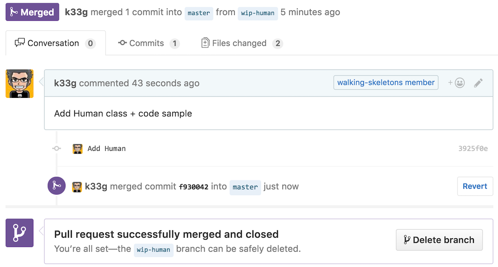
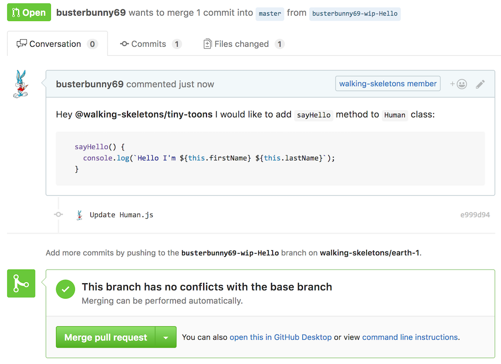
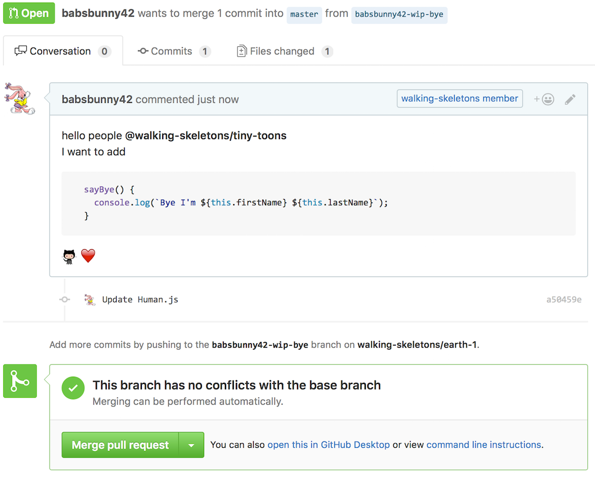
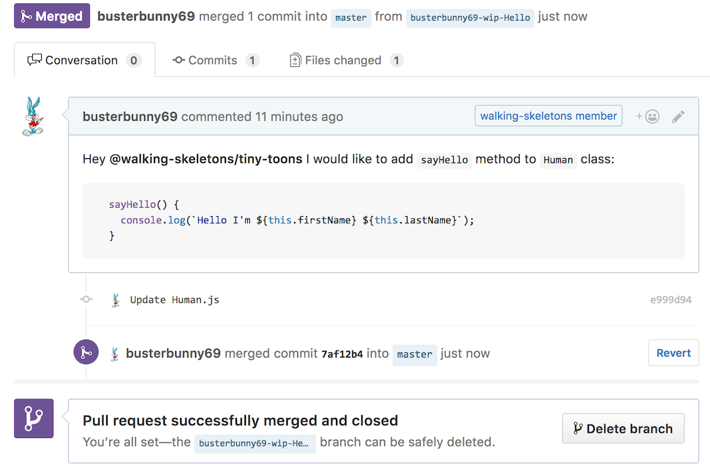

# Programmation par "features" en JavaScript

> WIP

## Création d'un projet "earth-1" sous GitHub

En tant que [@k33g](https://github.com/k33g), j'ai créé un projet https://github.com/walking-skeletons/earth-1. J'ai une "Team":



J'ai créé une première pull request en ajoutant du code:

- `libs/Human.js`
- `main.js`



Que j'ai ensuite mergée sur `master` ... Donc jusque là tout va bien



## Maintenant on bosse à plusieurs: "tiny toons in action"

Dans un 1er temps, j'ai [@busterbunny69](https://github.com/busterbunny69) qui va proposer une pull request en créant une branche `busterbunny69-wip-Hello` car il veut ajouter une méthode `sayHello()` à la classe `Human`:

```javascript
class Human {
  constructor({firstName, lastName}) {
    this.firstName = firstName;
    this.lastName = lastName;
  }

  sayHi() {
    console.log(`Hi I'm ${this.firstName} ${this.lastName}`);
  }
  
  sayHello() {
    console.log(`Hello I'm ${this.firstName} ${this.lastName}`);
  }
}

module.exports = {
  Human: Human
};
```



De son côté, [@babsbunny42](https://github.com/babsbunny42) souhaite ajouter via la branche `babsbunny42-wip-bye` une méthode `sayBye()`  à la classe `Human`:

```javascript
  sayBye() {
    console.log(`Bye I'm ${this.firstName} ${this.lastName}`);
  }
```



## Et Buster n'attend pas Babs, il merge!

Donc [@busterbunny69](https://github.com/busterbunny69) décide sans plus attendre de merger sa PR:



Et il est tout content :smile: ... Et nous fout un peu la :poop:, surtout chez [@babsbunny42](https://github.com/babsbunny42) qui ne peut plus merger:


Alors ce n'est pas plus grave que ça, **git** est là pour nous aider. Mais imaginez une équipe plus nombreuse, pas forcément disciplinée (mais quelle idée de bosser en même temps sur la même classe :laughing: ... oui je sais dès fois on n'a pas le choix), etc... 
Mais est-ce que notre façon d'écrire du code ne pourrait pas nous aider à éviter ce type de collision?

## Une autre version: Création d'un projet "earth-2"

Alors en tant que [@k33g](https://github.com/k33g), j'ai créé un nouveau projet https://github.com/walking-skeletons/earth-2 avec la même team. Mais cette fois ci j'ai une petite différence dans ma classe `Human`:

```javascript
class Human {
  constructor({firstName, lastName}, ...features) {
    this.firstName = firstName;
    this.lastName = lastName;
    return Object.assign(this, ...features);
  }

  sayHi() {
    console.log(`Hi I'm ${this.firstName} ${this.lastName}`);
  }
}

module.exports = {
  Human: Human
};
```

### Qu'est-ce qui a changé?

Essentiellement mon constructeur:

- `constructor({firstName, lastName}, ...features)` avec `...features` qui me permet de multiples arguments à une méthode sans savoir focément à l'avance combien (cf. https://developer.mozilla.org/en/docs/Web/JavaScript/Reference/Operators/Spread_operator)
- puis `return Object.assign(this, ...features);` qui va cloner `this` (l'instance de la classe) et lui coller les propriétés ou méthodes contenu dans `...features` et retourner un nouvel objet. (cf. https://developer.mozilla.org/en/docs/Web/JavaScript/Reference/Global_Objects/Object/assign) Pensez au traits de Scala ou Groovy (ou les augmentations nommées de Golo)

### Mais ça sert à quoi?

Un bout de code sera plus parlant:

```javascript
const Human = require('./libs/Human').Human

function goodMorning() {
  console.log(`Good Morning I'm ${this.firstName} ${this.lastName}`);
}

let bob = new Human({
  firstName: "Bob",
  lastName: "Morane"
}, {goodMorning:goodMorning});

bob.sayHi();
bob.goodMorning();
```

J'ai donc "greffé" une nouvelle méthode à mon instance de `Human` sans avoir à modifier la classe `Human`. Du coup, maintenant [@babsbunny42](https://github.com/babsbunny42) et [@busterbunny69](https://github.com/busterbunny69) ne devraient plus se marcher sur les pieds:

## Feature sayHello par Buster

Cette fois-ci [@busterbunny69](https://github.com/busterbunny69) ne va pas modifier `Human.js` mais créer une "feature" `sayhello.js`:

```javascript
function sayHello() {
  console.log(`Hello I'm ${this.firstName} ${this.lastName}`);
}

module.exports = {
  sayHello: sayHello
};
```

Et pour l'utiliser il fera ceci:

```javascript
const Human = require('./libs/Human').Human
const sayHello = require('./libs/sayhello')

let bob = new Human({
  firstName: "Bob",
  lastName: "Morane"
}, sayHello);

bob.sayHi();
bob.sayHello();
```

Du coup Buster a préparé sa pull request

> ICI IMAGE

## Feature sayBye par Babs

De son côté Babs crée elle aussi une feature `saybye.js`

```javascript
function sayBye() {
  console.log(`Bye I'm ${this.firstName} ${this.lastName}`);
}
  
module.exports = {
  sayBye: sayBye
};
```

Que nous pourrons utiliser de cette manière:

```javascript
const Human = require('./libs/Human').Human
const sayBye = require('./libs/saybye')

let bob = new Human({
  firstName: "Bob",
  lastName: "Morane"
}, sayBye);

bob.sayHi();
bob.sayBye();
```

Babs a préparé elle aussi sa pull request

> ICI IMAGE

## Buster continue à n'en faire qu'à sa tête

Donc à nouveau Buster merge:

> ICI IMAGE

Mais cette fois ci cela n'a aucun impact sur la pull request de Babs:

> ICI IMAGE

## Et finalement...

Une fois toutes les features mergées, nous pourrons les utiliser comme ceci:

```javascript
const Human = require('./libs/Human').Human
const sayHello = require('./libs/sayhello')
const sayBye = require('./libs/saybye')


let bob = new Human({
  firstName: "Bob",
  lastName: "Morane"
}, sayHello, sayBye);

bob.sayHi();
bob.sayHello();
bob.sayBye();
```

Donc dès fois, plutôt que de se compliquer la vie avec votre gestion de conf, penser à "écrire" votre code autrement (IMHO). :wink:
