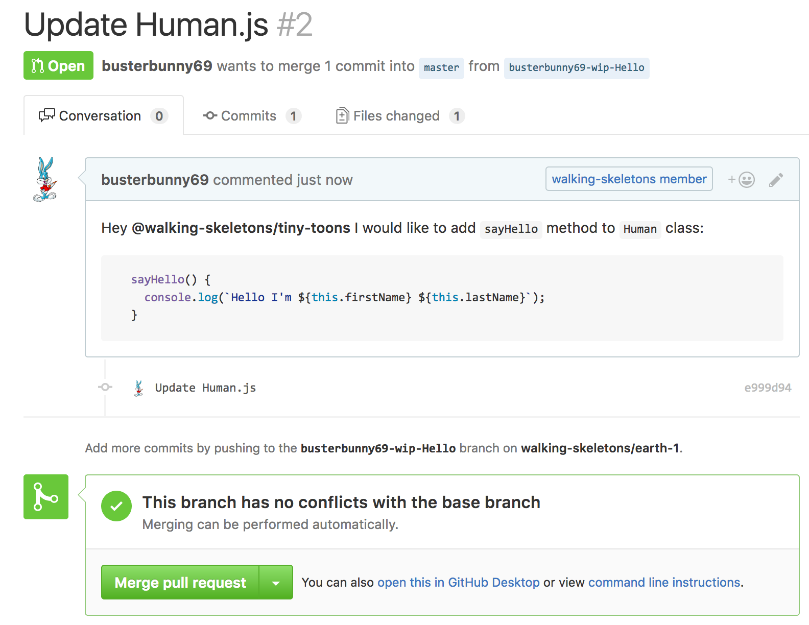

# Programmation par "features" en JavaScript

> WIP

## Création d'un projet sous GitHub

En tant que [@k33g](https://github.com/k33g), j'ai créé un projet https://github.com/walking-skeletons/earth-1. J'ai une "Team":


J'ai créé une première pull request en ajoutant du code:

- `libs/Human.js`
- `main.js`


Que j'ai ensuite mergée sur `master` ... Donc jusque là tout va bien


## Maintenant on bosse à plusieurs: "tiny toons in action"

Dans un 1er temps, j'ai [@busterbunny69](https://github.com/busterbunny69) qui va proposer une pull request en créant une branche `busterbunny69-wip-Hello` car il veut ajouter une méthode `sayHello()` à la classe `Human`:

```javascript
class Human {
  constructor({firstName, lastName}) {
    this.firstName = firstName;
    this.lastName = lastName;
  }

  sayHi() {
    console.log(`Hi I'm ${this.firstName} ${this.lastName}`);
  }
  
  sayHello() {
    console.log(`Hello I'm ${this.firstName} ${this.lastName}`);
  }
}

module.exports = {
  Human: Human
};
```



De son côté, [@babsbunny42](https://github.com/babsbunny42) souhaite ajouter via la branche `babsbunny42-wip-bye` une méthode `sayBye()`  à la classe `Human`:

```javascript
  sayBye() {
    console.log(`Bye I'm ${this.firstName} ${this.lastName}`);
  }
```


## Et Buster n'attend pas Babs, il merge!

Donc [@busterbunny69](https://github.com/busterbunny69) décide sans plus attendre de merger sa PR:


Et il est tout content :smile: ... Et nous fout un peu la :poop:, surtout chez [@babsbunny42](https://github.com/babsbunny42) qui ne peut plus merger:


